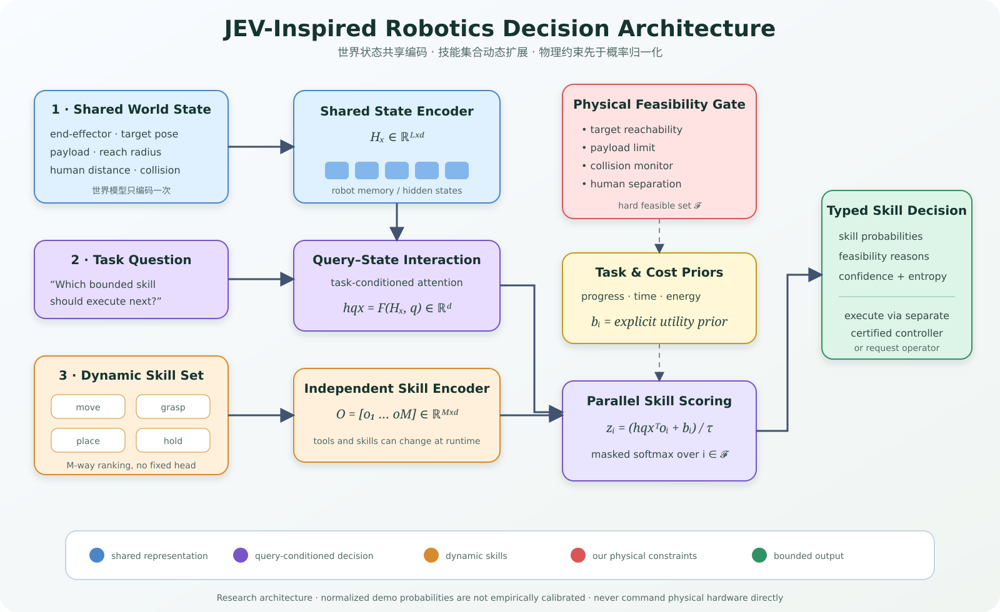
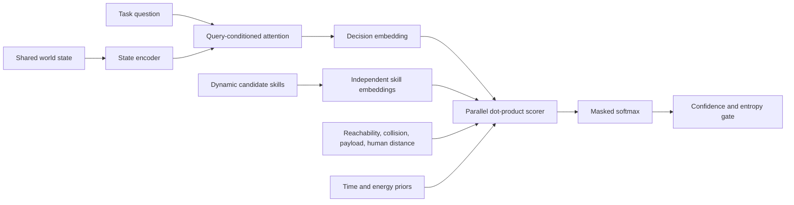

# Architecture

## Public fact versus implementation hypothesis

JEV is publicly described as a model for typed, bounded decisions and probability outputs. Its hidden architecture is not public. This repository therefore labels the candidate-embedding network as a hypothesis and supplies an original, inspectable implementation that others can test or replace.

## Pipeline

For each feasible skill \(i\):

\[
z_i = \frac{h_{qx}^{\mathsf T}o_i + b_i}{\tau}, \qquad
p_i = \operatorname{softmax}_{i \in \mathcal{F}}(z)
\]

The output dimension is dynamic because \(M\), the number of skills, is not compiled into a final classifier layer.

## Step-by-step explanation / 分步解释

1. **Shared world state / 共享世界状态** — end-effector pose, target, reach radius, payload, human distance and collision state are encoded once into \(H_x\).
2. **Task question / 任务问题** — task-conditioned attention combines the question vector \(q\) with \(H_x\), producing decision embedding \(h_{qx}\).
3. **Dynamic skill set / 动态技能集合** — move, grasp, place, hold or newly registered tools are each represented by \(o_i\). The model scores any \(M\) without rebuilding a fixed classifier.
4. **Physical feasibility / 物理可行性** — reachability, payload, collision status, human separation and manipulation preconditions define feasible set \(\mathcal{F}\). Rejected skills receive zero probability.
5. **Task and cost priors / 任务与代价先验** — explicit \(b_i\) terms reward task progress and account for estimated time and energy. The components remain visible in code.
6. **Parallel scoring / 并行打分** — dot products for all skills can be computed as one matrix operation; masked softmax normalizes only feasible skills.
7. **Uncertainty and execution boundary / 不确定性与执行边界** — low top probability or high normalized entropy produces `request_operator`. A separate safety-rated controller must validate and execute physical motion.

The red feasibility gate is intentionally outside the semantic scorer. A model may rank valid skills, but cannot make an invalid skill executable by assigning it a high score.

## Engineering separation

- **Semantic layer:** ranks valid candidates against state and question.
- **Constraint layer:** rejects physically or operationally invalid candidates.
- **Uncertainty layer:** requests an operator when the distribution is too flat or the best probability is too low.
- **Execution boundary:** a separate, certified controller must validate and execute any physical action.

## Replacing the demo encoder

`HashTextEncoder` makes the repository deterministic and offline. Research users can implement the same `encode` and `encode_tokens` interface with a trained encoder, then evaluate calibration and ranking quality on a suitably licensed dataset. The tests for feasibility masking remain applicable.
